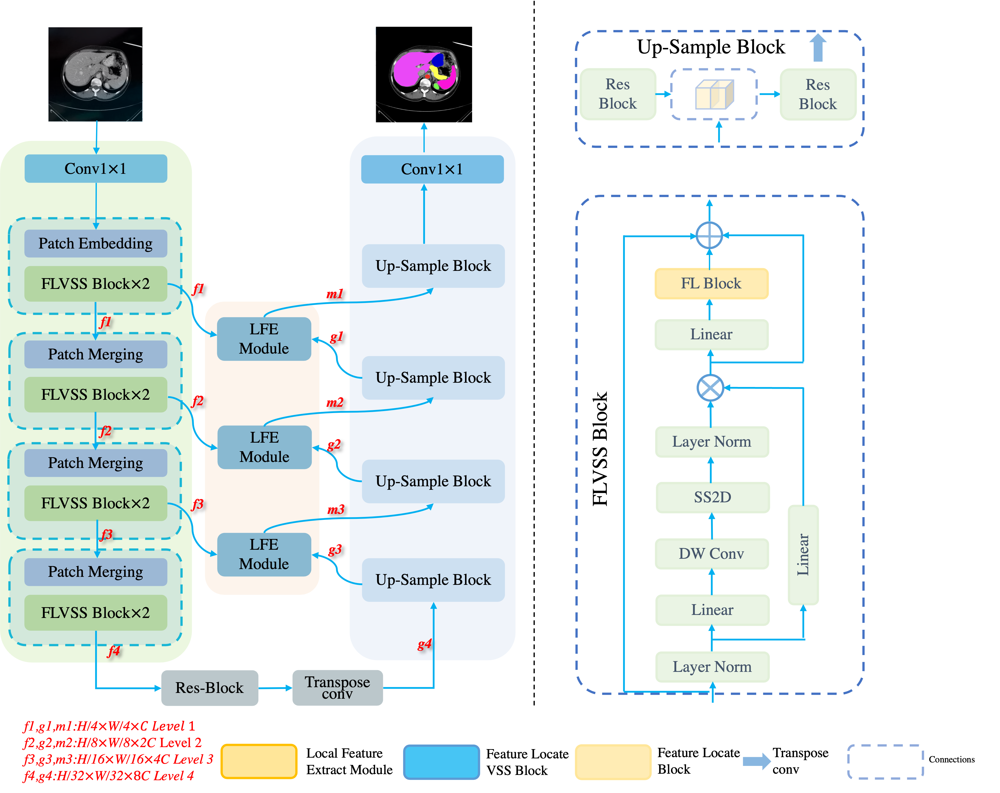

# GCGLE-UMamba:Global Context-Guide Local Extraction Vision Mamba-based UNet for Medical Segmentation   ICML 2025 

We propose *GCGLE-UMamba* to address these issues, which
is a novel Mamba-based network. We introduce a Feature
Localization Block (FLB) to remove irrelevant background
information and locate effective regions in the foreground.
To better integrate the features extracted at different scales
by the network, we design the Feature Locate Visual Space
State Block (FLVSSB), which uses FLB to locate foreground
local information. GCGLE-UMamba also uses a Local Feature
Extraction Module (LFFM) to extract and enhance foreground
regions’ local features. These two modules effectively improve
our network’s ability to capture local information and fuse
global semantic information.

